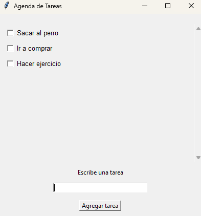

# Agenda de Tareas

Este es un programa simple de **agenda de tareas** que permite al usuario agregar y eliminar tareas. La aplicación utiliza una interfaz gráfica creada con **Tkinter** en **Python**. Puedes escribir tus tareas, marcarlas como completadas y eliminarlas de la lista.
<p align="center">  </p>

## Características

- Agregar tareas a una lista de tareas.
- Marcar tareas como completadas, lo que cambia su color y las tacha.
- Eliminar tareas que están marcadas como completadas.
- Interfaz gráfica sencilla con desplazamiento para ver todas las tareas.

## Requisitos

- Python 3.x
- Tkinter (generalmente viene preinstalado con Python)

## Instrucciones de Uso

1. **Instalación**: Asegúrate de tener **Python 3.x** instalado en tu sistema. Si no tienes Tkinter, instálalo utilizando el siguiente comando (en caso de que no esté preinstalado):

   ```bash
   pip install tk
